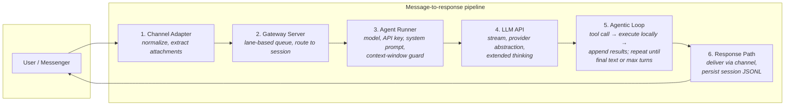

# Architecture

High-level architecture of the OpenClaw codebase: major functions, components, layering, workflow, and third-party dependencies. We keep the tone light where it helps; the details are still the details.

## 1. High-Level Architecture

At its core, OpenClaw is a **TypeScript CLI application** — not Python, Next.js, or a web app. It is a single process that:

- Runs on your machine and exposes a **gateway server** to handle all channel connections (Telegram, WhatsApp, Slack, etc.).
- Makes calls to **LLM APIs** (Anthropic, OpenAI, local, etc.).
- **Executes tools locally** (exec, filesystem, browser, process management).
- Does whatever you allow it to do on your computer (within the guardrails you set).

The system is organized as:

- **Single control plane (Gateway)** — One long-lived process per host that owns all channels, sessions, and agent runs. The gateway is the heart of the system—and the traffic cop: the task and session coordinator that handles overlapping requests and passes work to the right session.
- **Multi-channel inbox** — WhatsApp, Telegram, Slack, Discord, Signal, iMessage, WebChat, and more (core + extensions).
- **Pi agent runtime** — Embedded LLM agent (Pi SDK) with tools, streaming, and session/workspace handling.
- **CLI + apps** — The `openclaw` CLI, macOS menubar app, iOS/Android nodes, and web Control UI all talk to the Gateway over WebSocket (or HTTP for some APIs).

So: **one Gateway**, many **channels** and **clients**, one **agent runtime** per run, and shared **config/sessions/routing**.

### What OpenClaw is technically

---

## 2. Concepts

Gateway WebSocket connections declare a **role** at handshake time. The two roles are **control-plane client** (operator) and **node**. Both connect over the same WebSocket endpoint; the role determines what the connection can do.

### Control-plane client (operator)

A **control-plane client** connects with `role: "operator"`. It **controls** the gateway: it runs agents, sends messages, changes config, approves exec requests, and pairs devices. Examples are the `openclaw` CLI, the web Control UI, and the macOS menubar app when used for menus, WebChat, status, and config. The client requests one or more **scopes** (e.g. `operator.read`, `operator.write`, `operator.admin`, `operator.approvals`, `operator.pairing`); the gateway restricts which methods it can call and which server-push events it receives based on those scopes. Only operator connections receive events such as presence, agent streams, tick, exec approval requests, and device pairing requests.

### Node

A **node** connects with `role: "node"` and declares **caps**, **commands**, and **permissions** in the connect params. A node is a **device the gateway controls**: it exposes commands (e.g. `canvas.*`, `camera.*`, `screen.record`, `location.get`) that the gateway invokes via `node.invoke`; the node runs them and sends back results or events. Examples are the iOS app, the Android app, and the macOS app when running in node mode (e.g. Voice Wake, Talk overlay). The gateway only allows a node to call a small set of methods: `node.invoke.result`, `node.event`, and `skills.bins`; all other control-plane methods (config, channels, agent, send, health, etc.) are rejected. Nodes are registered in the gateway **NodeRegistry**, participate in device-based pairing, and can receive targeted events such as `voicewake.changed`. They do not receive operator-only broadcast events.

### Canvas

A **canvas** is the agent-controlled view on a node (Mac, iOS, Android) that can show web content or agent-driven UI. Its main purpose is to put visual and interactive output in front of the user on their device: the agent can present HTML (games, dashboards, generated content), drive a live UI via A2UI (JSONL updates), and capture what is on screen (snapshot) for vision or replies. The gateway serves canvas content from a **canvas host** handler on the same HTTP server as the gateway (same process and port), at path `/__openclaw__/canvas/`; nodes load those URLs in a WebView and expose commands such as `canvas.present`, `canvas.navigate`, `canvas.eval`, `canvas.snapshot`, and `canvas.a2ui.push` so the agent can show and control the view.

---

## 3. Major Components and Layering

### Entry and CLI (`src/cli`, `src/commands`)

- **Entry:** `openclaw.mjs` → `dist/entry.js` → `buildProgram()` (Commander).
- **CLI flow:** `run-main.ts` → optional fast routes (`tryRouteCli`) → `buildProgram()` → `registerProgramCommands()` + plugin commands → `program.parseAsync()`.
- **Commands** live in `src/commands/`: gateway, agent, message, config, onboard, doctor, channels, models, memory, etc. They use shared helpers (config, sessions, infra) and call into the gateway (via WS/local) or run the agent locally (`agentCommand`).

### Gateway (`src/gateway`)

- **Role:** HTTP + WebSocket server; runs channels, handles WS clients (apps, nodes, UI), and dispatches `agent` / `chat` / `send` to the agent and outbound.
- **Startup:** `startGatewayServer()` in `server.impl.ts`: load config, migrate if needed, resolve runtime config (bind, TLS, control UI, auth), create runtime state (`createGatewayRuntimeState`), start sidecars (browser, Gmail, etc.), start channels (`createChannelManager`), set up Bonjour/Tailscale discovery, then listen.
- **Runtime state:** HTTP server(s), WebSocket server, canvas host, client set, broadcast, agent run seq, dedupe, chat run state, abort controllers. Handlers live in `server-methods/` (e.g. `agent.ts`, `chat.ts`, `send.ts`).
- **Agent path:** WS `agent` (or HTTP) → validate params → resolve session/agent → `agentCommand(...)` (from `src/commands/agent.ts`) to run the Pi agent; responses streamed back over WS/HTTP.
- **Channels:** Gateway starts each channel via `ChannelManager.startChannel()` → plugin `gateway.startAccount(ChannelGatewayContext)`. Channels run in-process (e.g. Telegram bot, Slack app, WhatsApp/Baileys) and push inbound messages into the **auto-reply** pipeline.

### Channels (`src/channels`, `src/telegram`, `src/discord`, …)

- **Core channel layer** (`src/channels`): registry, docks (lightweight metadata/behavior), session recording, allowlists, command gating, mention gating, reply prefix, typing, targets.
- **Channel plugins** (`src/channels/plugins`): catalog, load, config schema, normalize, onboarding, outbound, status, actions, etc. Types: `ChannelPlugin`, `ChannelGatewayAdapter`, `ChannelOutboundAdapter`, etc.
- **Per-channel implementations:** e.g. `src/telegram` (grammY bot, handlers, delivery), `src/slack` (Bolt), `src/discord`, `src/signal`, `src/imessage`, `src/web` (WhatsApp/Baileys). Each connects to the provider and turns incoming messages into a **message context** and then into the auto-reply flow.

### Routing (`src/routing`)

- **Session keys and agent routing:** `resolve-route.ts`, `bindings.ts`, `session-key.ts`. Given config, channel, accountId, peer (dm/group/channel), resolves **agentId**, **sessionKey**, **mainSessionKey** ("binding.peer", "binding.guild", etc. or "default"). This is how OpenClaw decides _which_ agent and session handle a message—no guesswork.

### Auto-Reply and Agent Invocation (`src/auto-reply`)

- **Role:** Turn an inbound message context (from any channel) into a reply—commands, directives, or a full agent run.
- **Flow:** Inbound context → allowlist/mention gating, pairing, session key → `getReplyFromConfig` / reply pipeline → either built-in command or **agent run** via `runEmbeddedPiAgent` (see `reply/followup-runner.ts`, `reply/agent-runner*.ts`). Reply is then sent back through the channel's delivery (e.g. Telegram `deliverReplies`).
- **Pieces:** Commands registry, directives (think, verbose, queue, exec, etc.), block streaming, reply dispatcher, session/usage, memory flush, subagents.

### Agent Runtime (`src/agents`)

- **Pi embedded:** `pi-embedded-runner` (`runEmbeddedPiAgent` / `runEmbeddedAttempt`), `pi-embedded-subscribe` (streaming events: message*start/update/end, tool_execution*_, agent_start/end). Uses `@mariozechner/pi-_` packages for session, model, and tools.
- **CLI runner:** `cli-runner.ts` — alternative path that runs the agent from CLI (e.g. `openclaw agent --message "..."`).
- **Unified entry:** `agentCommand()` in `src/commands/agent.ts`: resolves session, workspace, model, timeout; then either `runEmbeddedPiAgent` or `runCliAgent`. Used by gateway `agent`/`chat`, hooks, OpenResponses, OpenAI-compat HTTP, and node events.
- **Tools:** Large tool set under `src/agents/tools/` (browser, exec, memory, cron, etc.); schema and execution are adapted for Pi/google-antigravity (e.g. no `Type.Union` in tool schemas).

### Config (`src/config`)

- **Load/merge:** `config.ts` (loadConfig), merge-config, includes, env substitution, paths. Zod schemas in `zod-schema.*.ts`; types in `types.*.ts`.
- **Sessions:** `sessions/` (store, metadata, transcript, session-key, main-session, group). Session file path and persistence drive agent context.
- **Legacy:** legacy detection and migrations so old configs are upgraded on read.

### Infra (`src/infra`)

- **Cross-cutting:** Binaries, dotenv, env, ports, errors, retry, backoff, gateway lock, restart sentinel.
- **Outbound:** `infra/outbound/` — deliver, envelope, channel adapters, target resolution, session mirroring, message actions.
- **Provider usage:** provider-usage (cost/usage), auth (device auth store, pairing).
- **Discovery:** Bonjour (Ciao), Tailscale, widearea DNS.
- **Other:** Heartbeat runner, exec approvals, state migrations, skills-remote, etc.

### Hooks (`src/hooks`)

- **Webhook-style hooks:** Config-driven mappings; gateway exposes `/hooks` (or custom path); normalized payloads can trigger agent runs or other actions (e.g. Gmail watcher, voice wake). See `gateway/hooks.ts`, `hooks-mapping`, and hook runner.

### Plugins and Extensions

- **Core plugins** (`src/plugins`): Discovery (e.g. `extensions/*`), loader, manifest registry, CLI registration, HTTP routes, services. Plugins can add channel adapters, auth providers, tools.
- **Extensions** (`extensions/`): Optional packages (e.g. bluebubbles, matrix, msteams, voice-call, google-antigravity-auth). Each has `openclaw.plugin.json` and implements channel/auth/tools as needed.

### Daemon (`src/daemon`)

- **Role:** Install/run the gateway as a supervised process (launchd on macOS, systemd user on Linux). `commands/configure.daemon.ts`, `daemon-runtime.ts`, etc. The gateway is the one daemon that keeps running; there is no separate agent daemon hiding under the hood.

### Memory (how OpenClaw remembers)

Without a proper memory system, an AI assistant is little better than a goldfish. OpenClaw uses two layers:

- **Session transcripts** — Persisted as JSONL under `~/.openclaw/agents/<agentId>/sessions/*.jsonl` (`resolveSessionTranscriptPath()` in `src/config/sessions/paths.ts`; append/read via `SessionManager` from pi-coding-agent and `ensureSessionHeader` / append in `src/config/sessions/transcript.ts`). One JSON object per line: user message, tool calls, results, assistant responses. This is session-based memory: the agent sees recent history when continuing a conversation.
- **Memory files** — Markdown in the agent workspace: `MEMORY.md` (or `memory.md`) for long-term facts and preferences, and `memory/YYYY-MM-DD.md` (or `memory/YYYY-MM-DD-slug.md`) for daily or session logs. The agent writes these via the standard file **write** tool (no special memory API). The files are the source of truth; the model only “remembers” what is on disk.

**Storage.** The workspace lives at `agents.defaults.workspace` (default `~/.openclaw/workspace`). A derived search index is stored per agent at `~/.openclaw/memory/<agentId>.sqlite` (path from `resolveMemorySearchConfig()` in `src/agents/memory-search.ts`). The search manager is `getMemorySearchManager()` in `src/memory/search-manager.ts` (builtin index: `MemoryIndexManager` in `src/memory/manager.ts`). An optional **QMD** backend (`memory.backend = "qmd"`) uses a sidecar under `~/.openclaw/agents/<agentId>/qmd/` for BM25 + vectors + reranking while Markdown remains the source of truth.

**What gets loaded when (selection for chat/tasks).** At session start, **bootstrap** injects fixed workspace files (`resolveBootstrapContextForRun()` in `src/agents/bootstrap-files.ts`, called from `src/agents/pi-embedded-runner/run/attempt.ts` and `src/agents/cli-runner.ts`): `AGENTS.md`, `SOUL.md`, `TOOLS.md`, `IDENTITY.md`, `USER.md`, `HEARTBEAT.md`, `BOOTSTRAP.md`, and—for the **main agent only**—`MEMORY.md` / `memory.md`. Subagent sessions receive only `AGENTS.md` and `TOOLS.md` (no MEMORY in context) (`filterBootstrapFilesForSession()` in `src/agents/workspace.ts`). Daily logs in `memory/` are not pre-injected; they are available only via the memory search tools. At reply time the model uses **memory_search** (semantic and optional keyword over `MEMORY.md` and `memory/**/*.md`, and optionally session transcripts) and **memory_get** (read a memory file by path) to recall prior work, decisions, people, preferences, and todos (`createMemorySearchTool()` and `createMemoryGetTool()` in `src/agents/tools/memory-tool.ts`, backed by `getMemorySearchManager()` in `src/memory/search-manager.ts`). The system prompt instructs the agent to run `memory_search` before answering such questions.

**Workflow.** The model writes durable facts to `MEMORY.md` and day-to-day notes to `memory/YYYY-MM-DD.md`. When a session is **close to auto-compaction**, OpenClaw runs a **silent agentic turn** (pre-compaction memory flush) that prompts the model to write durable memory before context is compacted (`runMemoryFlushIfNeeded()` in `src/auto-reply/reply/agent-runner-memory.ts`, called from `src/auto-reply/reply/agent-runner.ts`; `resolveMemoryFlushSettings()` and `shouldRunMemoryFlush()` in `src/auto-reply/reply/memory-flush.ts`). This is controlled by `agents.defaults.compaction.memoryFlush` and is skipped when the workspace is read-only (e.g. sandbox) or for heartbeat/CLI runs. One flush per compaction cycle (tracked in the session store). The bundled **session-memory** hook can, on `/new`, summarize the previous conversation and write it to `memory/YYYY-MM-DD-slug.md` (`saveSessionToMemory` in `src/hooks/bundled/session-memory/handler.ts`).

**Search and indexing.** Memory search is a hybrid of **vector similarity** and **keyword match** (vector store via sqlite-vec; keyword via SQLite FTS5), so both semantic matches (e.g. “authentication bug” → “auth issues”) and exact phrases (IDs, code symbols) are covered (`MemoryIndexManager` in `src/memory/manager.ts`, hybrid in `src/memory/hybrid.ts` and `src/memory/manager-search.ts`; sync in `src/memory/sync-memory-files.ts`). Indexed content: `MEMORY.md`, `memory.md`, `memory/**/*.md`, plus optional `memorySearch.extraPaths` and, when enabled, session transcripts (`memorySearch.experimental.sessionMemory`). Sync runs when a file watcher sees changes (debounced), on session start, on search, or on an interval; session indexing is delta-based. Embedding provider is configurable (local / openai / gemini / auto). Tools `memory_search` and `memory_get` are provided by the active memory plugin (default `memory-core`) (`src/plugins/runtime/index.ts` registers them via `createMemorySearchTool` / `createMemoryGetTool`); set `plugins.slots.memory = "none"` to disable.

Memory is deliberately simple: no merging of memories, no monthly or weekly compression. Old memories persist with roughly equal weight (no “forgetting curve”). The design favors explainable simplicity over complex pipelines—no memory-spaghetti.

### Computer use and safety

OpenClaw gives the agent significant computer access at the user’s discretion—yes, really. Capabilities include:

- **Exec tool** — Run shell commands in a **sandbox** (default: Docker), **directly on the host**, or on **remote devices**.
- **Filesystem tools** — Read, write, and edit files.
- **Browser tool** — Playwright-based control with **semantic snapshots** (see below).
- **Process tool** — Manage long-running or background commands, kill processes, etc.

**Safety:** Similar in spirit to Claude Code. An **allowlist** (e.g. `~/.openclaw/exec-approvals.json` or equivalent) lets the user approve commands per agent (allow once, always, or deny with a prompt). Safe commands (e.g. `jq`, `grep`, `cut`, `sort`, `uniq`, `head`, `tail`, `tr`, `wc`) can be pre-approved. Dangerous shell constructs are blocked by default, e.g. command substitution, redirection to sensitive paths, chained `||`, and subshells used for risky operations. The goal is as much autonomy as the user allows.

**Browser: semantic snapshots** — The browser tool does not rely primarily on screenshots. It uses **semantic snapshots**: a text representation of the page’s accessibility tree (ARIA). The agent sees elements like `button "Sign In" [ref=1]`, `textbox "Email" [ref=2]`, etc. Browsing is treated as a structural task, so snapshot size stays small (e.g. under ~50 KB vs. multi‑MB screenshots) and token cost stays sane.

### Other Notable Areas

- **Media** (`src/media`): Fetch, parse, MIME, image ops, store, server; used for attachments and tooling.
- **Browser** (`src/browser`): Playwright-based browser control server; tools use semantic snapshots (accessibility tree) for low-token, structural page representation.
- **Cron** (`src/cron`): Scheduled jobs (schedule, store, service, isolated-agent runs).
- **TUI** (`src/tui`): Pi TUI for terminal UI.
- **ACP** (`src/acp`): Agent Client Protocol (e.g. `@agentclientprotocol/sdk`).

---

## 4. Workflow Summary

1. **Process start:** User runs `openclaw gateway` (or app starts it). Gateway loads config, migrates if needed, starts HTTP+WS, canvas host, sidecars, then **channels** (each channel's `gateway.startAccount` runs the bot/client).
2. **Inbound message:** e.g. Telegram → grammY handler → build message context (route, session key, allowlist) → **auto-reply** pipeline → command or **runEmbeddedPiAgent** → replies sent back via channel delivery.
3. **Client request:** macOS app / CLI / WebChat connects over WS → `connect` → then e.g. `agent` or `chat` request → gateway resolves session/agent → **agentCommand** → **runEmbeddedPiAgent** → stream events back to client.
4. **Send message:** `send` (WS or CLI) → resolve channel/account/target → **infra/outbound** deliver → channel-specific send (e.g. Telegram API, Slack API).
5. **Routing:** Every inbound message gets a **session key** and **agentId** via `routing.resolveAgentRoute()` (bindings + config); that drives which agent and session file are used.

### Message-to-response flow (end-to-end)

When you message OpenClaw from a channel, here’s the path from your words to the reply:

1. **Channel adapter** — Takes the raw message and processes it (normalize, extract attachments). Each messenger or input stream has its own adapter.
2. **Gateway server** — The task and session coordinator receives the message and passes it to the right session. It handles overlapping requests using a **lane-based command queue**: each session has a dedicated lane, and low-risk parallelizable work (e.g. cron jobs) can run in parallel lanes.
3. **Agent runner** — Resolves which model to use, picks the API key (with cooldown and fallback if one fails), assembles the system prompt with tools, skills, memory, and session history (from a `.jsonl` file), then passes through a **context-window guard** (compact or fail gracefully when context is nearly full).
4. **LLM API call** — The call streams responses and uses an abstraction over providers; it can request extended thinking when the model supports it.
5. **Agentic loop** — If the LLM returns a tool call, OpenClaw runs it locally and appends the results to the conversation. This repeats until the LLM returns final text or hits max turns (default ~20). Tool, reply, tool, reply—you get the idea.
6. **Response path** — Replies go back through the channel. The session is persisted as JSONL (one JSON object per line: user message, tool calls, results, responses). That persistence is how OpenClaw remembers within a session.

### Lane-based serialization

To avoid race conditions and unreadable interleaved logs, OpenClaw **defaults to serial execution** and parallelizes only where explicitly safe. A **lane** is an abstraction over queues: serialization is the default, not an afterthought. Each session has its own lane; parallel lanes are used for independent work (e.g. cron). The mental model shifts from “what do I need to lock?” to “what’s safe to parallelize?” Naive async per agent leads to interleaved garbage and shared-state races—the queue handles ordering so you can focus on what’s safe to run in parallel instead of debugging race-condition nightmares.

---

## 5. Pi agent runtime (detailed)

OpenClaw’s agent is built on **Pi**, a minimal, opinionated AI coding agent by [Mario Zechner](https://mariozechner.at/). Pi is not Raspberry Pi—it’s a TypeScript/Node.js agent framework focused on simplicity, context control, and embedding in other apps. (We get that question a lot.)

### What Pi is

- **Project:** [pi-mono](https://github.com/badlogic/pi-mono) on GitHub (badlogic) — a monorepo with coding-agent CLI, unified LLM API, TUI, Slack bot, and SDK for embedding. The repo has 2,000+ stars and active development.
- **Author:** Mario Zechner (LibGDX, Bad Logic Games). He described building Pi in [“What I learned building an opinionated and minimal coding agent”](https://mariozechner.at/posts/2025-11-30-pi-coding-agent) (Nov 2025): a lean agent that prioritizes explicit context and avoids the complexity and churn he saw in other coding agents.
- **Design:** Pi deliberately keeps scope small: core tools (read, write, edit, bash), multi-provider LLM support, session/context management, compaction, and an extensions system. It does **not** include MCP, sub-agents, or built-in planning UIs. Context engineering is central.
- **Docs / install:** [buildwithpi.ai](https://buildwithpi.ai/) (and the tongue-in-cheek [shittycodingagent.ai](https://shittycodingagent.ai/)—worth a visit); install via `npm install -g @mariozechner/pi-coding-agent` for the standalone CLI.

### How OpenClaw uses Pi

OpenClaw embeds Pi **in-process** via the **SDK** path: it does not shell out to the `pi` CLI. It uses these npm packages:

| Package                           | Role in OpenClaw                                                                                                                                                                   |
| --------------------------------- | ---------------------------------------------------------------------------------------------------------------------------------------------------------------------------------- |
| **@mariozechner/pi-agent-core**   | Core session and message types (e.g. `AgentMessage`); session lifecycle.                                                                                                           |
| **@mariozechner/pi-ai**           | Unified LLM API: `streamSimple`, types like `AssistantMessage`, `ImageContent`; multi-provider (Anthropic, OpenAI, Google, etc.).                                                  |
| **@mariozechner/pi-coding-agent** | Session manager and tools: `createAgentSession`, `SessionManager`, `SettingsManager`; base tools `readTool`, `createReadTool`, `createWriteTool`, `createEditTool`, `codingTools`. |
| **@mariozechner/pi-tui**          | Terminal UI; used for the `openclaw tui` experience.                                                                                                                               |

The **embedded** path is implemented under `src/agents/`: Pi’s session and streaming API are driven from OpenClaw’s process, with OpenClaw adding tools, system prompts, sandbox, and channel-specific behavior.

### Main functions and flow

1. **Entry:** `agentCommand()` (`src/commands/agent.ts`) or the auto-reply pipeline → `runEmbeddedPiAgent()` (`src/agents/pi-embedded-runner/run.ts`).
2. **Run:** `runEmbeddedPiAgent()` enqueues work per session/global lane, resolves model/auth, builds system prompt and bootstrap context, then calls `runEmbeddedAttempt()` (`pi-embedded-runner/run/attempt.ts`).
3. **Attempt:** `runEmbeddedAttempt()` uses Pi’s `createAgentSession()` and `streamSimple()` (from `@mariozechner/pi-ai`). It prepares history (with optional compaction), injects OpenClaw tools via `createOpenClawTools()` (`pi-tools.ts`), and subscribes to the session with `subscribeEmbeddedPiSession()`.
4. **Subscribe:** `subscribeEmbeddedPiSession()` (`src/agents/pi-embedded-subscribe.ts`) wires Pi’s streaming events to OpenClaw:
   - **Lifecycle:** `agent_start`, `agent_end`, `auto_compaction_start`, `auto_compaction_end`
   - **Messages:** `message_start`, `message_update`, `message_end`
   - **Tools:** `tool_execution_start`, `tool_execution_update`, `tool_execution_end`
     Handlers live in `pi-embedded-subscribe.handlers.*`; they drive block streaming, reasoning tags, tool summaries, and delivery callbacks.
5. **Tools:** OpenClaw extends Pi’s minimal set with many tools in `src/agents/tools/` and `pi-tools.ts`: bash/exec, browser, memory, cron, session send/spawn, Discord/Slack/Telegram/WhatsApp actions, TTS, etc. Tool schemas are adapted for OpenClaw (and for providers like Google that disallow `Type.Union`).
6. **Concurrency:** Runs are serialized per session (and optionally per global lane) via `enqueueCommandInLane()` so one session does not run multiple agent turns at once.
7. **Abort / queue:** `abortEmbeddedPiRun()`, `queueEmbeddedPiMessage()`, `isEmbeddedPiRunActive()`, `waitForEmbeddedPiRunEnd()` allow cancellation and queuing from the gateway and auto-reply layers.

### Key files (summary)

| Area                 | Path                                           | Purpose                                                                                                                  |
| -------------------- | ---------------------------------------------- | ------------------------------------------------------------------------------------------------------------------------ |
| Embedded API surface | `src/agents/pi-embedded.ts`                    | Re-exports `runEmbeddedPiAgent`, `subscribeEmbeddedPiSession`, abort/queue/compact helpers.                              |
| Run orchestration    | `src/agents/pi-embedded-runner/run.ts`         | Lanes, model resolution, retries, compaction, fallback thinking.                                                         |
| Single attempt       | `src/agents/pi-embedded-runner/run/attempt.ts` | Pi `createAgentSession` + `streamSimple`, OpenClaw tools and system prompt, `subscribeEmbeddedPiSession`.                |
| Event subscription   | `src/agents/pi-embedded-subscribe.ts`          | Maps Pi stream events to block chunks, reasoning, tool meta, callbacks.                                                  |
| Tools                | `src/agents/pi-tools.ts`                       | Builds OpenClaw tool set (read/write/edit/exec + channels + browser + memory + …); uses Pi’s `codingTools` and adapters. |
| Helpers              | `src/agents/pi-embedded-helpers/`              | Error classification, failover, sanitization, bootstrap, provider-specific (e.g. Google turn ordering).                  |
| Extensions           | `src/agents/pi-extensions/`                    | Context pruning, compaction safeguards.                                                                                  |

### History and popularity

- Pi emerged in 2025 as a reaction to complex, fast-changing coding agents; the “minimal and opinionated” post is from late Nov 2025.
- The **pi-mono** repo is the main hub: MIT-licensed, 2,000+ GitHub stars, multiple packages (coding-agent, pi-ai, pi-tui, etc.).
- OpenClaw pins specific versions (e.g. `@mariozechner/pi-agent-core@0.49.3`, `pi-coding-agent@0.49.3`) and integrates via the SDK rather than the CLI, so it can stay on a known API while Pi evolves—no surprise breakages.

---

## 6. Third-Party Dependencies

Each dependency is listed with a short description and a link to its main site or npm page. The usual suspects, nothing exotic.

### Runtime and CLI

| Package        | Description                                        | Link                                                             |
| -------------- | -------------------------------------------------- | ---------------------------------------------------------------- |
| **Node.js**    | JavaScript runtime (≥22); ESM, `"type": "module"`. | [nodejs.org](https://nodejs.org/)                                |
| **TypeScript** | Typed superset of JavaScript; build and types.     | [typescriptlang.org](https://www.typescriptlang.org/)            |
| **Commander**  | CLI framework for defining commands and options.   | [github.com/tj/commander.js](https://github.com/tj/commander.js) |

### Messaging and Channels

| Package                             | Description                                                            | Link                                                                                     |
| ----------------------------------- | ---------------------------------------------------------------------- | ---------------------------------------------------------------------------------------- |
| **grammy**                          | Telegram Bot API framework for Node.js.                                | [grammy.dev](https://grammy.dev/)                                                        |
| **@grammyjs/runner**                | Concurrent update runner for grammY bots.                              | [grammy.dev](https://grammy.dev/)                                                        |
| **@grammyjs/transformer-throttler** | Rate-limiting transformer for grammY.                                  | [grammy.dev](https://grammy.dev/)                                                        |
| **@whiskeysockets/baileys**         | WebSocket-based library for the WhatsApp Web API.                      | [github.com/WhiskeySockets/Baileys](https://github.com/WhiskeySockets/Baileys)           |
| **@slack/bolt**                     | Framework for building Slack apps with shortcuts, events, and actions. | [slack.dev/bolt](https://slack.dev/bolt-js/)                                             |
| **@slack/web-api**                  | Official Slack Web API client.                                         | [slack.dev](https://slack.dev/)                                                          |
| **discord-api-types**               | TypeScript definitions for the Discord API.                            | [github.com/discordjs/discord-api-types](https://github.com/discordjs/discord-api-types) |
| **@line/bot-sdk**                   | Official LINE Messaging API SDK for Node.js.                           | [developers.line.biz](https://developers.line.biz/)                                      |

### Agent Runtime

| Package                           | Description                                                      | Link                                                                                                           |
| --------------------------------- | ---------------------------------------------------------------- | -------------------------------------------------------------------------------------------------------------- |
| **@mariozechner/pi-agent-core**   | Core runtime for the Pi embedded agent (session, model, tools).  | [npmjs.com/package/@mariozechner/pi-agent-core](https://www.npmjs.com/package/@mariozechner/pi-agent-core)     |
| **@mariozechner/pi-ai**           | Pi AI / model integration.                                       | [npmjs.com/package/@mariozechner/pi-ai](https://www.npmjs.com/package/@mariozechner/pi-ai)                     |
| **@mariozechner/pi-coding-agent** | Pi coding-agent components.                                      | [npmjs.com/package/@mariozechner/pi-coding-agent](https://www.npmjs.com/package/@mariozechner/pi-coding-agent) |
| **@mariozechner/pi-tui**          | Pi terminal UI.                                                  | [npmjs.com/package/@mariozechner/pi-tui](https://www.npmjs.com/package/@mariozechner/pi-tui)                   |
| **@agentclientprotocol/sdk**      | TypeScript SDK for the Agent Client Protocol (editors ↔ agents). | [agentclientprotocol.com](https://agentclientprotocol.com/)                                                    |

### Cloud and APIs

| Package                     | Description                                                | Link                                                      |
| --------------------------- | ---------------------------------------------------------- | --------------------------------------------------------- |
| **@aws-sdk/client-bedrock** | AWS SDK client for Amazon Bedrock (optional LLM provider). | [aws.amazon.com/bedrock](https://aws.amazon.com/bedrock/) |

### HTTP and Web

| Package         | Description                                              | Link                                                                         |
| --------------- | -------------------------------------------------------- | ---------------------------------------------------------------------------- |
| **express**     | Web framework for HTTP servers and middleware.           | [expressjs.com](https://expressjs.com/)                                      |
| **body-parser** | Parse HTTP request bodies (JSON, urlencoded, etc.).      | [github.com/expressjs/body-parser](https://github.com/expressjs/body-parser) |
| **hono**        | Lightweight web framework; used for gateway HTTP routes. | [hono.dev](https://hono.dev/)                                                |
| **ws**          | WebSocket client and server for Node.js.                 | [github.com/websockets/ws](https://github.com/websockets/ws)                 |
| **undici**      | HTTP/1.1 client; fast fetch implementation.              | [github.com/nodejs/undici](https://github.com/nodejs/undici)                 |

### Validation and Schema

| Package               | Description                                 | Link                                                                       |
| --------------------- | ------------------------------------------- | -------------------------------------------------------------------------- |
| **zod**               | Schema validation and TypeScript inference. | [zod.dev](https://zod.dev/)                                                |
| **@sinclair/typebox** | JSON Schema and type building (TypeBox).    | [github.com/sinclairzx81/typebox](https://github.com/sinclairzx81/typebox) |
| **ajv**               | Fast JSON Schema validator.                 | [ajv.js.org](https://ajv.js.org/)                                          |

### UI and CLI Output

| Package             | Description                                                  | Link                                                                             |
| ------------------- | ------------------------------------------------------------ | -------------------------------------------------------------------------------- |
| **@buape/carbon**   | Carbon UI components (pinned; do not update per repo rules). | [npmjs.com/package/@buape/carbon](https://www.npmjs.com/package/@buape/carbon)   |
| **@clack/prompts**  | Terminal prompts and inputs.                                 | [github.com/natemoo-re/clack](https://github.com/natemoo-re/clack)               |
| **chalk**           | Terminal string styling (colors, etc.).                      | [github.com/chalk/chalk](https://github.com/chalk/chalk)                         |
| **cli-highlight**   | Syntax highlighting for CLI output.                          | [npmjs.com/package/cli-highlight](https://www.npmjs.com/package/cli-highlight)   |
| **osc-progress**    | OSC-style progress / spinners for CLI.                       | [npmjs.com/package/osc-progress](https://www.npmjs.com/package/osc-progress)     |
| **qrcode-terminal** | Render QR codes in the terminal.                             | [github.com/gtanner/qrcode-terminal](https://github.com/gtanner/qrcode-terminal) |

### Media and Content

| Package                  | Description                                               | Link                                                                             |
| ------------------------ | --------------------------------------------------------- | -------------------------------------------------------------------------------- |
| **sharp**                | High-performance image processing (resize, format, etc.). | [sharp.pixelplumbing.com](https://sharp.pixelplumbing.com/)                      |
| **file-type**            | Detect file type from buffer.                             | [github.com/sindresorhus/file-type](https://github.com/sindresorhus/file-type)   |
| **pdfjs-dist**           | Mozilla PDF.js; render and parse PDFs.                    | [mozilla.github.io/pdf.js](https://mozilla.github.io/pdf.js/)                    |
| **@mozilla/readability** | Extract main readable content from HTML.                  | [github.com/mozilla/readability](https://github.com/mozilla/readability)         |
| **linkedom**             | DOM implementation for Node.js (JSDOM alternative).       | [github.com/WebReflection/linkedom](https://github.com/WebReflection/linkedom)   |
| **jszip**                | Create and read ZIP files.                                | [stuk.github.io/jszip](https://stuk.github.io/jszip/)                            |
| **markdown-it**          | Markdown parser and renderer.                             | [github.com/markdown-it/markdown-it](https://github.com/markdown-it/markdown-it) |

### Browser Automation

| Package             | Description                                                              | Link                                                                                           |
| ------------------- | ------------------------------------------------------------------------ | ---------------------------------------------------------------------------------------------- |
| **playwright-core** | Browser automation (Chromium, Firefox, WebKit) without bundled browsers. | [playwright.dev](https://playwright.dev/)                                                      |
| **chromium-bidi**   | Chrome DevTools Protocol / BiDi for browser automation.                  | [github.com/GoogleChromeLabs/chromium-bidi](https://github.com/GoogleChromeLabs/chromium-bidi) |

### Discovery and Networking

| Package              | Description                                                        | Link                                                             |
| -------------------- | ------------------------------------------------------------------ | ---------------------------------------------------------------- |
| **@homebridge/ciao** | RFC 6763 DNS-SD / mDNS (Bonjour) in TypeScript; gateway discovery. | [github.com/homebridge/ciao](https://github.com/homebridge/ciao) |
| **long**             | Long integer support (e.g. for protobuf / APIs).                   | [npmjs.com/package/long](https://www.npmjs.com/package/long)     |

### Config and Environment

| Package    | Description                               | Link                                                             |
| ---------- | ----------------------------------------- | ---------------------------------------------------------------- |
| **dotenv** | Load `.env` into `process.env`.           | [github.com/motdotla/dotenv](https://github.com/motdotla/dotenv) |
| **json5**  | JSON5 parser (comments, trailing commas). | [json5.org](https://json5.org/)                                  |
| **yaml**   | YAML parser and serializer.               | [github.com/eemeli/yaml](https://github.com/eemeli/yaml)         |

### Utilities

| Package              | Description                                           | Link                                                                                             |
| -------------------- | ----------------------------------------------------- | ------------------------------------------------------------------------------------------------ |
| **tslog**            | Structured logger for Node.js.                        | [github.com/fullstack-build/tslog](https://github.com/fullstack-build/tslog)                     |
| **proper-lockfile**  | File-based locking (e.g. gateway lock).               | [github.com/moxystudio/node-proper-lockfile](https://github.com/moxystudio/node-proper-lockfile) |
| **croner**           | Cron-like job scheduler.                              | [github.com/hexagon/croner](https://github.com/hexagon/croner)                                   |
| **chokidar**         | File system watcher.                                  | [github.com/paulmillr/chokidar](https://github.com/paulmillr/chokidar)                           |
| **@lydell/node-pty** | Pseud terminal (PTY) bindings for terminal emulation. | [github.com/microsoft/node-pty](https://github.com/microsoft/node-pty)                           |
| **node-edge-tts**    | Edge TTS for text-to-speech.                          | [npmjs.com/package/node-edge-tts](https://www.npmjs.com/package/node-edge-tts)                   |
| **tar**              | Tar archive creation and extraction.                  | [github.com/npm/node-tar](https://github.com/npm/node-tar)                                       |
| **detect-libc**      | Detect C library (glibc vs musl) for native binaries. | [github.com/lovell/detect-libc](https://github.com/lovell/detect-libc)                           |
| **jiti**             | Runtime TypeScript/ESM loader (e.g. for config).      | [github.com/unjs/jiti](https://github.com/unjs/jiti)                                             |

### Optional Dependencies

| Package             | Description                                      | Link                                                                               |
| ------------------- | ------------------------------------------------ | ---------------------------------------------------------------------------------- |
| **@napi-rs/canvas** | Canvas 2D implementation (Node.js native addon). | [github.com/napi-rs/canvas](https://github.com/napi-rs/canvas)                     |
| **node-llama-cpp**  | Node bindings for llama.cpp (local LLM).         | [github.com/withcatai/node-llama-cpp](https://github.com/withcatai/node-llama-cpp) |

### Database and Vectors

| Package        | Description                                    | Link                                                                     |
| -------------- | ---------------------------------------------- | ------------------------------------------------------------------------ |
| **sqlite-vec** | SQLite extension for vector similarity search. | [npmjs.com/package/sqlite-vec](https://www.npmjs.com/package/sqlite-vec) |

### Dev and Test

| Package                 | Description                                       | Link                                                                   |
| ----------------------- | ------------------------------------------------- | ---------------------------------------------------------------------- |
| **vitest**              | Unit and integration test runner (Vite-native).   | [vitest.dev](https://vitest.dev/)                                      |
| **@vitest/coverage-v8** | V8 coverage provider for Vitest.                  | [vitest.dev](https://vitest.dev/)                                      |
| **tsx**                 | TypeScript execute; run TS without pre-compiling. | [github.com/privatenumber/tsx](https://github.com/privatenumber/tsx)   |
| **oxlint**              | Fast linter (Rust-based).                         | [github.com/oxc-project/oxlint](https://github.com/oxc-project/oxlint) |
| **oxfmt**               | Code formatter (Oxc).                             | [github.com/oxc-project/oxfmt](https://github.com/oxc-project/oxfmt)   |
| **wireit**              | Script runner and caching (npm scripts).          | [github.com/google/wireit](https://github.com/google/wireit)           |

### Apps (Separate Stacks)

- **macOS:** Swift/SwiftUI (e.g. in `apps/macos`).
- **iOS:** Swift/SwiftUI, Xcode (e.g. in `apps/ios`).
- **Android:** Kotlin, Gradle (e.g. in `apps/android`).
